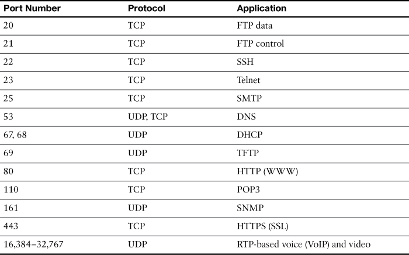
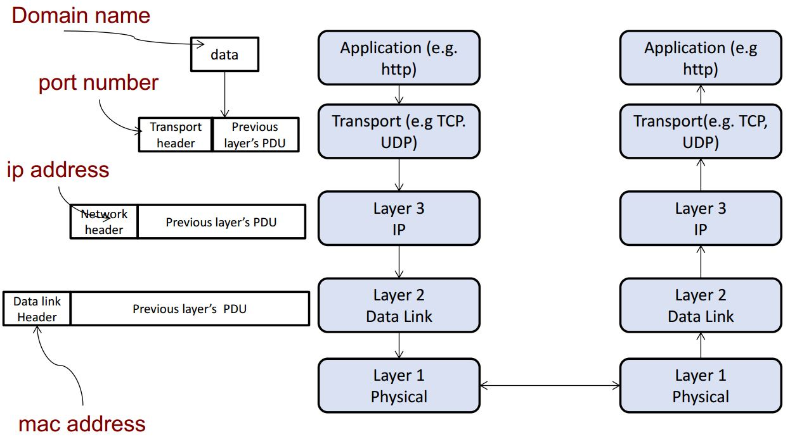

# A brief introduction to networks

## Table of Contents
1. [What is the Internet?](#what-is-the-internet)
2. [Sidenote](#sidenote-ip-address-port-number-mac-address)
3. [The IP Stack](#the-ip-stack)
4. [Types of security protocols at different layers](#types-of-security-protocols-at-different-layers)

## What is the Internet?
- It is a network of (networks of) connected hosts. Hosts refer to devices or `things` that run network applications such as phones, computers, satellites etc. 
- **The question is, how do they communicate with each other?**

### Sidenote: IP address, port number, MAC address
- What are they?

#### What are IP Addresses? 
- There are two types of IP addresses, public and private. 

- **Public** IP address is used to identify a (sub) network in the Internet, for example, your home network, school network etc. Therefore two or more devices in the same network share the same **public** IP address.

- **Private** IP address is used to identify a host within a (sub) network. Most of the time, private IP addresses are assigned dynamically (through DHCP), and therefore every time you connect to the WiFi it is likely to be different.

**Exercise (optional)**: google `ip address` on your PC as well as on your phone through the same WiFi connection. Are they the same? 

#### What are MAC addresses?
- **Media Access Control (MAC)** address: this is also specific to a host/device - strictly speaking, they are `Network-Interface-Controller`-specific. In most cases, unique MAC addresses are assigned by the manufacturers to each NIC.
- NSA took advantage of this to link individuals to their devices through MAC addresses in order to monitor its citizens, according to Edward Snowden.

src: <http://thehackernews.com/2014/01/spying-agencies-tracking-your-location_31.html>

**Exercise (optional)**: find out your MAC address

OS | Command | remark
--- | --- | ---
 Windows | in cmd.exe, `ipconfig /all` | shown as `Physical address`
 Linux, OS-X |  in shell, `ifconfig -a` | shown as `HWaddr`

**But MAC addresses can be spoofed**
- `Legit` reasons why you may do this: 
1. Some ISPs limit the number of hosts connected to the Internet from a network
2. Some networks filter out access from hosts by their MAC address
3. You don't want NSA to know which devices belong to you.

If interested, take a look at <https://www.youtube.com/watch?v=mzwA7tm6zi8>
 
#### And the port numbers?
- port numbers are necessary to identify `processes` running on a host. A host can run many applications, each of which is a process. Without a port number, how would the OS know whether to forward the packet to TCP/UDP, HTTP, SMTP etc.?
- This is why processes are bound to unique port numbers.



---
### The IP Stack
- The IP Stack consists of 5 layers. The upper layers are built on top of the services the lower layers provide.



1. **Physical**: bits "on the wire"
2. **Link**: data transfer between neighbouring network elements (802.11, Ethernet etc.)
3. **network**: routing of `datagram` from source to destination i.e. Internet Protocol (IP).
4. **Transport**: `process-to-process` data transfer. UDP and TCP
5. **Application**: high-level applications, such as HTTP, FTP, SMTP, DNS ...

**Exercise**:

Fingerprinting. Use `telnet` or `nc` to collect a HTTP response header from a (possibly vulnerable) website and see if it returns you something interesting, such as `X-Powered-By`, `Server`, and `X-ASPNet-Version`.

1. `nc example.com port`
2. once you enter telnet/netcat,
```
HEAD / HTTP/1.1 <\r\n>
Host: host_name <\r\n>
<\r\n>
```

---
### Types of security protocols at different layers
**Note**: it is not necessarily the case that one security protocol completely covers the entire layer. Also, one security protocol may span across multiple layers.

Network Layer | Examples of security protocols
--- | ---
Physical/Link layer | <ul><li>WPA</li><li>WEP</li></ul>
network (IP) layer | <ul><li>IPSec</li></ul>
Transport layer | <ul><li>TLS</li><li>SSL</li><li>SSH</li></ul>
Application Layer | <ul><li>PGP</li><li>HTTPS</li><li>S/MIME</li></ul>

If interested, take a look at <http://www.tutorialspoint.com/network_security/>
