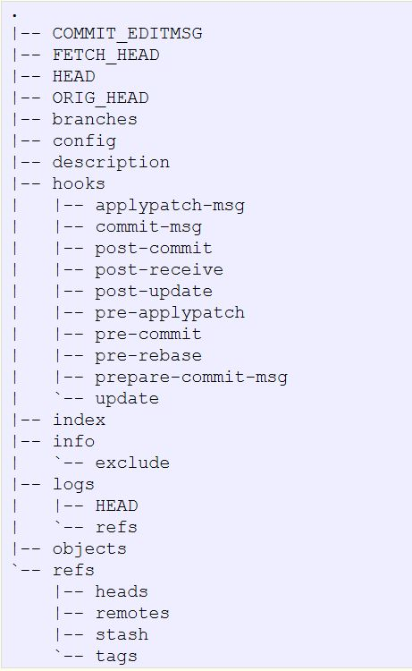

# Common web vulnerabilities (more to be added)

## Table of Contents
1. [Robots.txt](#robots.txt)
2. [.git folder](#git)

## Robots.txt

### What is it for?

- to restrict access to particular web pages/folders of your website by search-engine bots (or simply bots)
- It is just a simple `.txt` file, as the name suggests
- It is located at the top-level directory of a website, if any => to find one, just type in `http://www.example.com/robots.txt`

### Format
1. `User-agent`: this tells to which bots the rules that follow this line will apply
2. `Disallow`: this specifies which files/folders are to be ignored by the bots
e.g.
```
User-agent: *  (applies to all the bots)
Disallow: /secure/file.html (one specific file)
Disallow: /*.php$ (ALL files with .php extension)
```

### How can we exploit this?
- Entries in `robots.txt` are not *rules* => can simply ignore them and access the listed files as long as they are in the public domain of the website.
- By looking at `robots.txt`, you can quickly find out if the website has any interesting resources just as in the above example.

**Exercise**: Pick a website and see if it has `robots.txt`.

### Related write-ups
1. <https://buer.haus/2016/05/01/google-ctf-web-1-wallowing-wallabies-part-one/>

## .git
### What is it for?
- `.git` is a folder the VCS `git` creates in your repository.
- When deploying a web application, some admins simply clone the repository

### Structure
- Something like this


### How can we exploit this?
- This most likely contains FULL COPY of your repository, including all the previous revisions. If you have access to `.git` folder, it is possible to obtain the source codes of the website.
- This means **blackbox -> whilebox**

### How?
1. `git -r wget http://www.example.com/.git`
- This recursively downloads the `.git` folder to your local
2. `git checkout [OPTIONS]`
- using this command, you can recover the actual files

**note**: 
- this is assuming that *Directory Indexing* is enabled on the website. If not, then although it is more tedious, you can still recover the files by examining each commit hash, or by using tools such as `dvcs-ripper`. See <https://github.com/kost/dvcs-ripper>

### Not just for git
- This vulnerability does not apply only for git, but also for other VCS such as SVN, CVS etc.
- This is because they more or less do the same thing. For example,
```
http://www.example.com/.git/ <- git
http://www.example.com/.svn/ <- SVN
http://www.example.com/.hg/  <- Mercurial/HG 
```

### Related write-ups
1. <http://www.megabeets.net/csaw-2016-mfw-writeup/>

