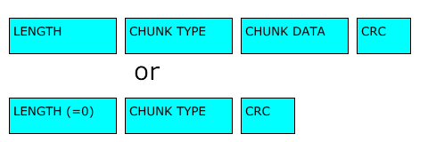
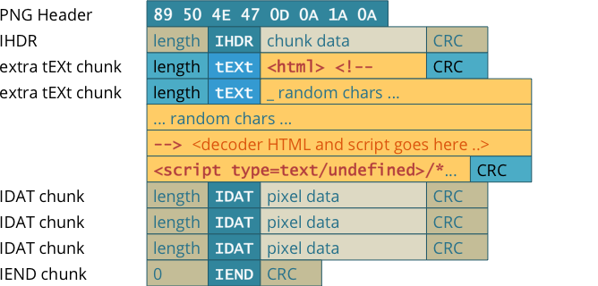

# PNG
## What is it
**Portable Network Graphics** (**PNG**) is an extensible file format for the lossless, portable, well-compressed storage of raster images.

## Structure
A PNG file consists of a PNG signature followed by a series of chunks.

### File signature
The first eight bytes of PNG file is always its file signature:
```
89 50 4E 47 0D 0A 1A 0A
```
### Chunks
A valid PNG image must contain an **IHDR** chunk, one or more **IDAT** chunks, and an **IEND** chunk.

In addition, it can  contain optional ancillary chunks. Some notable ancillary chunks includes the **iTXt**, **tEXt**, and **zTXt** chunks are used for conveying textual information associated with the image.

#### Chunk Layout


| Part | Description |
| - | - |
| Length | A 4-byte unsigned integer giving the number of bytes in the chunk's data field. |
| Chunk Type | A 4-byte chunk type code. |
| Chunk Data | Data bytes. |
| CRC | A 4-byte CRC calculated using the chunk type code and chunk data fields, but *not* including the length field |

### Putting Everything Together
A typical PNG file looks something like this:



To get more details on PNG, you can check out its specifications [here](http://www.libpng.org/pub/png/spec/1.2/PNG-Contents.html).

## Tools
| Tool | Description |
| - | - |
| [TweakPNG](http://entropymine.com/jason/tweakpng/) | A utility for examining and modifying PNG image files |
| [pngcheck](http://www.libpng.org/pub/png/apps/pngcheck.html) | Tool to verify the integrity of PNG, JNG and MNG files. It can also be use to dump almost all of the chunk-level information in the image in human-readable form.|
| [pngmeta](http://www.libpng.org/pub/png/apps/pngmeta.html) | It can be used to extract metadata, such as text annotations, from PNG images.|
